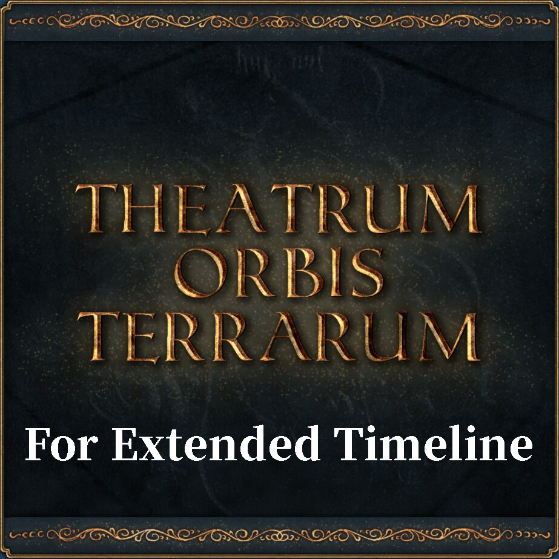

# ET-Theatrum-Orbis-Terrarum



[](https://github.com/Cccc-owo/ET-Theatrum-Orbis-Terrarum/releases)
[](https://github.com/Cccc-owo/ET-Theatrum-Orbis-Terrarum/tags)
[](https://github.com/Cccc-owo/ET-Theatrum-Orbis-Terrarum/graphs/commit-activity)

> Theatrum Orbis Terrarum translates to "Theatre of the World" and is considered to be the first true modern atlas. It was created in 1570 by flemish cartographer Abraham Ortelius. This mod tries to bring its look and feel to Europa Universalis IV.

「Extended Timeline」模组的地图美化子模组

Fork from [original mod](https://steamcommunity.com/sharedfiles/filedetails/?id=570256235) by [KRYO](https://steamcommunity.com/id/KRY0777)

## 下载 & 使用 / Download & Use

你可以在 [Releases](https://github.com/Cccc-owo/ET-Theatrum-Orbis-Terrarum/releases) 中下载到本地版 Mod。

<details><summary>本地版使用教程</summary>

下载 [Releases](https://github.com/Cccc-owo/ET-Theatrum-Orbis-Terrarum/releases/latest) 中的 ```mod.zip```，原样解压 ```mod.zip``` 至 ```文档 > Paradox Interactive > Europa Universalis IV > mod``` 目录下。打开启动器 ```dowser.exe```（正版玩家直接启动游戏相当于打开启动器），在**边栏**的**播放集**一页中，点击右上角的**添加更多 MOD**，将本模组加入播放集。接着确保本模组启用的情况下，启用需要的其他模组，并将本模组置于 ET 之下，返回主页开始游戏即可。

等待更新...

</details>

## 文件夹结构说明 / Folders structure of the repository

|文件夹 / folder|内容 / contents|备注 / notes|
|--------------|---------------|-----------|
|[.github](.github)|GitHub 工作流文件||
|[ETTOT](ETTOT)|模组文件||
|[mod_descriptor](mod_descriptor)|mod 描述符文件||
|output|输出文件夹|运行 ```main.bat``` 时会自动建立|

```7z.exe``` 和 ```7z.dll``` 提取自官方 7-Zip 22.01 (2022-07-15)

## 鸣谢 / Credits

[KRYO](https://steamcommunity.com/id/KRY0777) for [original mod](https://steamcommunity.com/sharedfiles/filedetails/?id=570256235)
